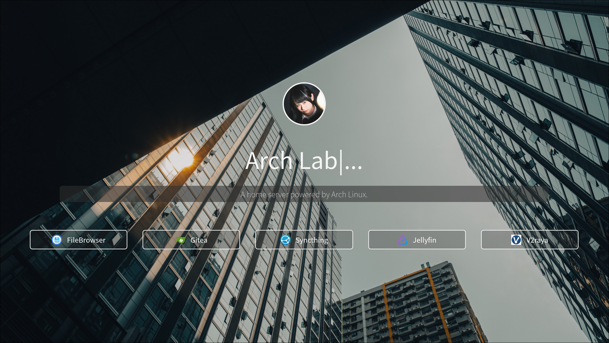

# Blank

A simple home page site.

## Preview



## Usage

- Command Line Setting
    ```shell
    $ cd <hugo site path>
    $ mkdir -p themes
    $ git clone https://github.com/axionl/hugo-blank-theme.git themes/blank
    $ cp themes/blank/exampleSite/config.toml .
    ```

- Config Setting (config.toml on the hugo site path)
    ```toml
    baseURL = 'http://example.org/'
    languageCode = 'en-us'
    title = 'Blank'
    theme = 'blank'

    [Params]
        name = 'Blank|...'
        description = 'A simple home page site.'
        favicon = '/images/favicon.ico'
        avatar = '/images/avaatr.jpg'

    [[params.links]]
    name = "Site A"
    icon = ""
    url = "http://a.example.org/"


    [[params.links]]
    name = "Site B"
    icon = ""
    url = "http://b.example.org/"
    ```
